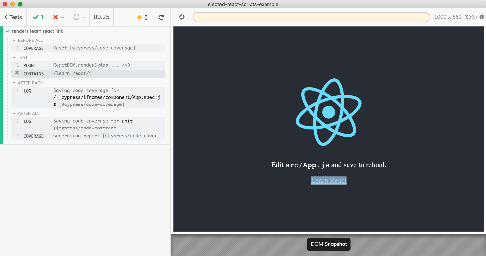

# ejected-react-scripts-example
> Component testing using [cypress-react-unit-test](https://github.com/bahmutov/cypress-react-unit-test) and ejected react-scripts

This example repo was created with

```shell
npx create-react-app ejected-react-scripts-example
cd ejected-react-scripts-example
yarn eject
```

Then I have added [Cypress](https://github.com/cypress-io/cypress) and [cypress-react-unit-test](https://github.com/bahmutov/cypress-react-unit-test)

```shell
yarn add -D cypress cypress-react-unit-test
```

The settings are in [cypress.json](cypress.json), and we use settings for _react scripts_ from [cypress-react-unit-test recipes](https://github.com/bahmutov/cypress-react-unit-test/blob/master/docs/recipes.md). Even with ejected react scripts!

The test [src/App.spec.js](src/App.spec.js) is passing


